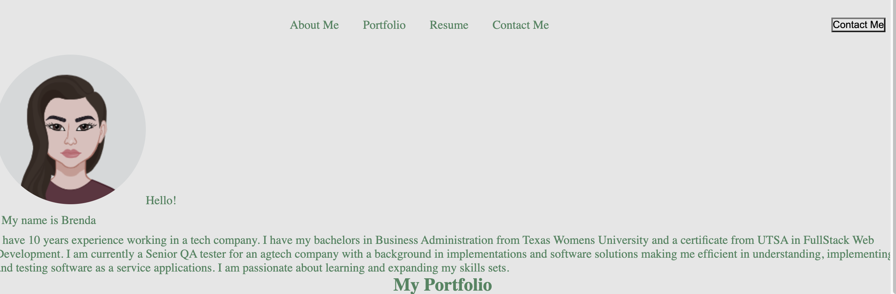

# reactportfolio

## Description
This is my portfolio website. It contains information about me, projects I have worked on and contact details for people to reach out with questions or comments.

## Table of Contents
* [Visuals](#visuals)
* [Installation](#installation)
* [Usage](#usage)
* [Resources](#resources)
* [Questions](#questions)

## Visuals

## Installation
npm install, npm start

## Usage
This is a portfolio for my projects and resume.

## Resources
https://reactjs.org/, https://www.npmjs.com/package/@material-ui/core, https://github.com/mui 

## Questions
For any questions, please contact me @ 
https://github.com/bramirez09
or
Email: bramirez09@icloud.com
